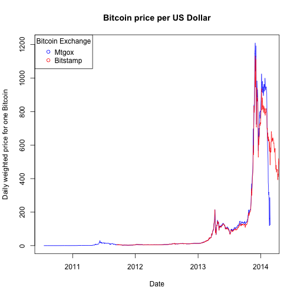

## Aim of this project

This project aims to give an overview over the price development of Bitcoin on two exchanges: Mtgox and Bitstamp. Since its inception and subsequent trading on exchanges, it has fluctuated a lot and trades at different prices across different platforms.
This applet is testing whether there are actually real price differences by applying a ttest to the difference of daily average prices.

Link to the applet: http://tmuetze.shinyapps.io/Project

---

## Data Cleaning

We first load the data:

```r
require(rCharts)
library(shiny)

mtgox <- read.csv("BITCOIN-MTGOXUSD.csv")
names(mtgox) <- c("Date", "Open", "High", "Low", "Close",
                  "VolumeBTC", "VolumeCurrency", "WeightedPrice")
mtgox$Date <- as.Date(mtgox$Date, "%m/%d/%y")

bitstamp <- read.csv("BITCOIN-BITSTAMPUSD.csv")
names(bitstamp)  <- c("Date", "Open", "High", "Low", "Close",
                      "VolumeBTC", "VolumeCurrency", "WeightedPrice")
bitstamp$Date <- as.Date(bitstamp$Date, "%m/%d/%y")
```

---

## The Applet - plot of average Bitcoin price per day


```r
plot(mtgox$Date, mtgox$WeightedPrice, main="Bitcoin price per US Dollar", col="blue",
     type="l", xlab="Date", ylab="Daily weighted price for one Bitcoin")
lines(bitstamp$Date, bitstamp$WeightedPrice, type="l", col="red")
legend("topleft", c("Mtgox", "Bitstamp"), pch = 1, col= c("blue","red"), title = "Bitcoin Exchange")
```

 


---

## The Applet - ttest
We then run a ttest at a user-chosen confidence level if the daily average is the same for both Bitcoin exchanges. Here is the example of a 95% confidence interval. The pvalue is 1.355%, thus we reject the hypothesis that the mean of prices at both exchanges are the same.


```r
mtgoxNew <- subset(mtgox, mtgox$Date>"2011-09-12")
bitstampNew <- subset(bitstamp, bitstamp$Date<"2014-02-26")
t.test(mtgoxNew$WeightedPrice-bitstampNew$WeightedPrice,
                alternative = c("two.sided"))$p.value
```

```
## [1] 0.01355
```

## Thank you!


